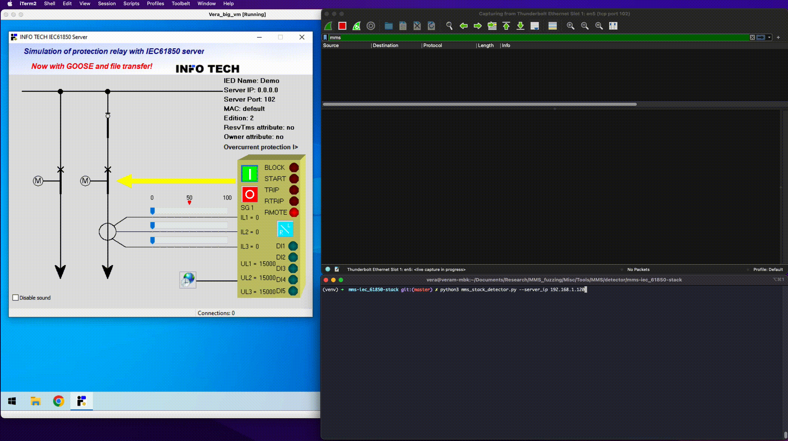

# MMS protocol stack detector



> Manufacturing Message Specification (MMS) is an international standard (ISO 9506) dealing with messaging systems for transferring real time process data and supervisory control information between networked devices or computer applications. From [Wikipedia](https://en.wikipedia.org/wiki/Manufacturing_Message_Specification)

MMS is popular protocol and multiple implementations exists in the market. It may be desirable to be able to indentify the specific implementation when performing a vulnerability research in order to better understand the attack surface. This tool is able to detect the most common MMS implementation stacks.

## Installation:
```
git clone https://github.com/claroty/MMS-Stack-Detector.git
cd MMS-Stack-Detector
python3 -m pip install -r requirements.txt
```

## Usage:
```
python3 mms_stack_detector.py --help
usage: mms_stack_detector.py [-h] [--server_ip SERVER_IP] [--from_file FROM_FILE] [--print_all_services]

MMS Stack Detector

options:
  -h, --help            show this help message and exit
  --server_ip SERVER_IP
                        Server/Device IP address
  --from_file FROM_FILE
                        Specify file path of IP addresses separated by newline
  --print_all_services  Whether to print the services along with the detected MMS stack
```

## Examples:
```
python3 mms_stack_detector.py --server_ip 10.10.10.10 --print_all_services

python3 mms_stack_detector.py --from_file /path/to/list_of_ip_addr > results.txt
```

### Example output:
```
-------------------------- MMS Stack Detector ---------------------------
---------------------------[  10.10.10.10  ]-----------------------------

[*] Server Identification 
        Vendor Name: libiec61850.com
        Model: NxD
        Version: 1.5.0
-------------------------------------------------------------------------
[*] MMS Stack: LibIEC61850 Sig [0xee1c000000000000000118]
=========================================================================
```

## Supported stacks
- [LibIEC61850](https://libiec61850.com/)
- [Triangle MicroWorks MMSd](https://www.trianglemicroworks.com/products/source-code-libraries/iec-61850-scl-pages)
- [Sisco MMS Lite](https://sisconet.com/wp-content/uploads/2019/04/MktLit_MMS-EASE-Lite_082014.pdf) (PDF)
- [INFO TECH S61850](https://www.infotech.pl/products/iec-61850/iec-61850-source-code-library)
- [Vizimax](https://www.vizimax.com/iec-61850/)
- [Bitronics](https://www.novatechautomation.com/products/orion-substation-automation#modal_extensive-protocol-library)

## How to add additional stack to the detector
The stack detection is based on a subset of supported services. Those services are sent in `InitiateResponse` packet.
If this subset of services is unique for this server, the the server can be identified.
The following are the steps to be done to add new server to the detector:
- Send a proper MMS `InitiateRequest` to the newly configured server
- Review the services in the `InitiateResponse` 
- Convert the services to the sequental bitmap
- If the bit sequence do not exist in `known_signatures` (the new server can be identified!), add the new sequence to the `known_signatures` struct .


## Dependencies
- [construct](https://construct.readthedocs.io/en/latest/)
- [bitarray](https://pypi.org/project/bitarray/)
